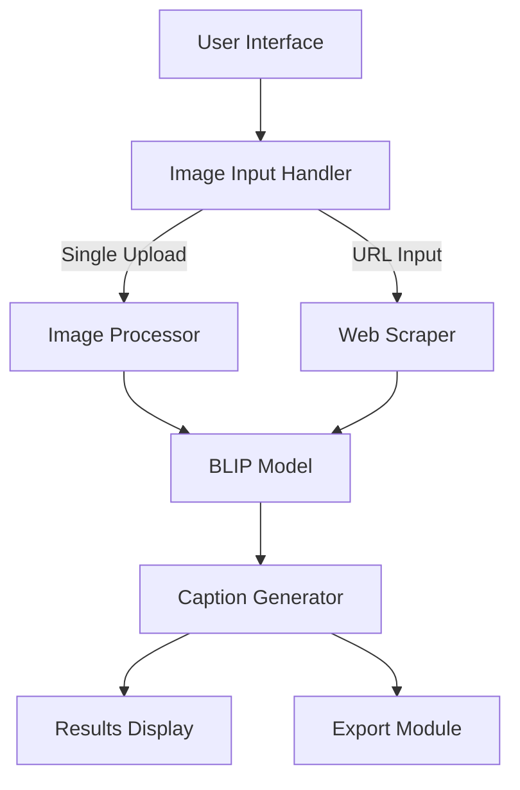

# Image Captioning Application


## Table of Contents
1. [Project Overview](#project-overview)
2. [Technical Architecture](#technical-architecture)
3. [Key Features](#key-features)
4. [Implementation Details](#implementation-details)
5. [Results and Demonstrations](#results-and-demonstrations)
6. [Technical Specifications](#technical-specifications)
7. [Installation and Setup](#installation-and-setup)
8. [Usage Guide](#usage-guide)

## Project Overview

The Image Captioning Application is an advanced AI-powered tool that automatically generates descriptive captions for images. Built using state-of-the-art deep learning techniques, it offers both single image processing and bulk web scraping capabilities.

### Core Functionalities
- Single image caption generation through direct upload
- Bulk image captioning through URL scraping
- Caption export in structured format

### Technology Stack
The application leverages the BLIP (Bootstrapping Language-Image Pre-training) model from Salesforce, known for its superior performance in image understanding and caption generation tasks.

## Technical Architecture

### System Components


### Core Components Breakdown

| Component | Technology | Purpose |
|-----------|------------|----------|
| Frontend | Streamlit | User interface and interaction |
| Backend | Python | Core processing and business logic |
| Model | BLIP | Image understanding and caption generation |
| Image Processing | PIL | Image manipulation and preparation |
| Web Scraping | BeautifulSoup4 | URL-based image extraction |

## Key Features

### 1. Dual Input System
- **Image Upload**
  - Supports JPG, JPEG, and PNG formats
  - Direct file selection from local system
  - Real-time preview capability

- **URL Processing**
  - Automated image extraction
  - Intelligent filtering of valid images
  - Batch processing capability

### 2. Advanced Processing Pipeline
- Automatic format conversion
- Size validation and optimization
- Error handling and recovery
- Progress tracking and feedback

### 3. Caption Generation
- AI-powered description generation
- Context-aware captioning
- Configurable output length
- High accuracy and relevance

### 4. Export System
- Structured text file generation
- Organized image-caption mapping
- Easy-to-read formatting
- Batch export capability

## Implementation Details

### Model Configuration
```python
processor = AutoProcessor.from_pretrained("Salesforce/blip-image-captioning-base")
model = BlipForConditionalGeneration.from_pretrained("Salesforce/blip-image-captioning-base")
```

### Processing Pipeline
1. **Image Intake**
   - Format validation
   - Size verification
   - Color space conversion

2. **Model Processing**
   - Tensor transformation
   - Feature extraction
   - Caption generation
   - Post-processing

3. **Output Handling**
   - Caption formatting
   - Export preparation
   - Result presentation

## Results and Demonstrations

### Single Image Processing


### URL-Based Processing


### Sample Output
The application generates a structured output file containing image URLs and their corresponding captions. View a sample output file [here](https://github.com/AryanDahiya00/Image-Captioning/blob/main/OUTPUT/captions.txt).

## Technical Specifications

### Dependencies
```plaintext
Python 3.x
transformers
requests
beautifulsoup4
streamlit
torch
langchain
PIL
```

### System Requirements
- Modern web browser
- Internet connection for model loading
- Minimum 4GB RAM recommended
- Python 3.7 or higher

## Installation and Setup

1. Clone the repository:
```bash
git clone https://github.com/[your-username]/Image-Captioning.git
```

2. Install dependencies:
```bash
pip install -r requirements.txt
```

3. Launch the application:
```bash
streamlit run main.py
```

## Usage Guide

### Single Image Processing
1. Launch the application
2. Click "Choose an image..." button
3. Select your image file
4. Click "Generate Caption"
5. View the results

### URL-Based Processing
1. Enter the target URL in the input field
2. Click "Scrape and Generate Captions"
3. Wait for processing to complete
4. Download the results file

## Best Practices
- Use high-quality images for better results
- Ensure stable internet connection
- Allow processing time for bulk operations
- Regularly check for software updates


